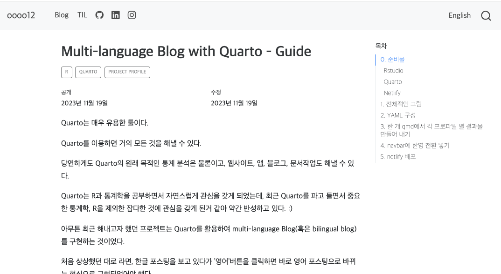

# Tech Blog using Quarto

이 레포는 [Quarto](https://quarto.org/)를 활용하여 만든 Bilingual 블로그의 구조를 담고있습니다.

## What is Quarto?

Quarto는 Python, R, Julia를 지원하는 파일 형식입니다.

Rmarkdown을 계승하여 대부분의 문법이 Rmarkdown과 동일합니다.

html, docx, pptx, pdf 등 여러 output을 만들어낼 수 있습니다.

이와 별개로 블로그, 책, 애플리케이션 등을 만드는 데에 활용할 수 있습니다.

더 자세한 사항은 https://quarto.org/ 를 참고하세요.

## Why were you using Quarto?

R에 푹 빠져있던 2023년 어느 날, Quarto를 알게 되어 블로그를 홀린 듯이 만들었습니다. 😵‍💫

## How did you make Bilingual Blog with Quarto?

Quarto의 profile 기능을 사용했습니다.

자세한 내용은 저의 [블로그 포스트](https://oooo12.ooo/blog/multilanguage-blog-with-quarto/)를 확인해주세요. 😌 

## History

* 2023-11-07 개설
* 2023-11-08 첫 게시물 업로드
* 2023-11-12 도메인(oooo12.ooo)구매
* 2024-01-09 TIL 메뉴 추가
* 2024-01-26 [TIL 업로드 자동화](https://github.com/oooo12-git/R-RPA_new-post-to-TIL) 사용